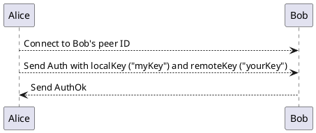

Paperwork
---------

## Documentation

### Protocol

#### Connect

```plantuml
@startuml
Alice --> Bob: Connect to Bob's peer ID
Alice --> Bob: Send Auth with localKey ("myKey") and remoteKey ("yourKey")
Bob --> Alice: Send AuthOk
@enduml
```
